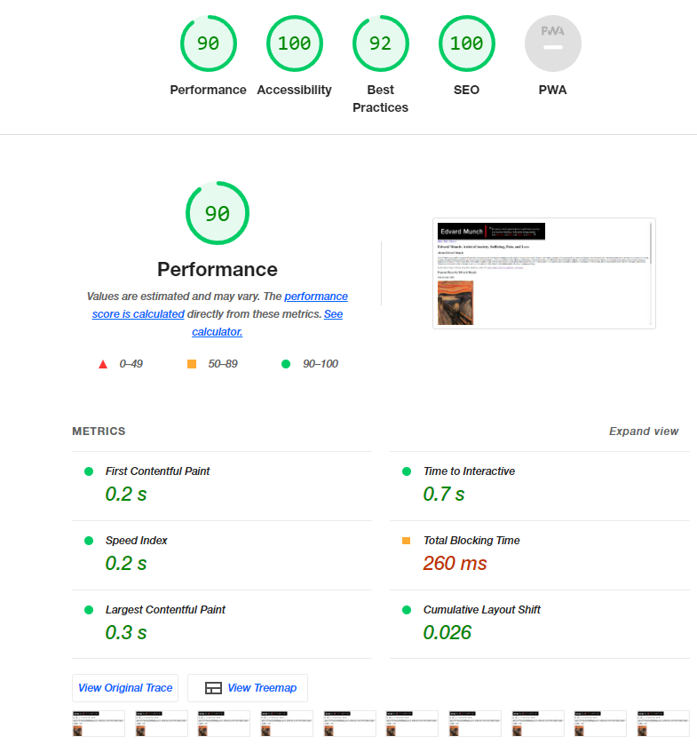
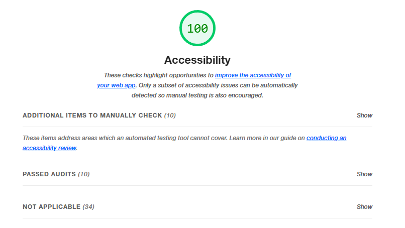
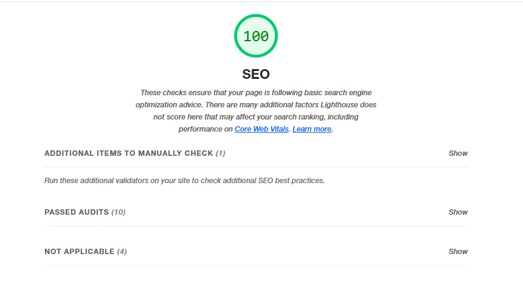

# m3-h3-christensen-kristine
Assignment 3: Use Semantic HTML to Create an SEO Optimized &amp; Accessible Website
## About This Project ##
The goal of this project is to write Semantic HTML. This will help enhance SEO Optimization and make for a more accessible website. I'm not sure about the Total Blocking Time. 
## Lighthouse Report ##

